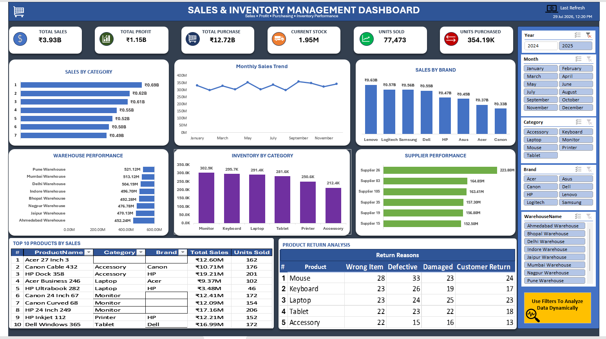

# Sales & Inventory Management Dashboard

## Project Overview

The Sales & Inventory Management Dashboard is a comprehensive business intelligence dashboard developed in Microsoft Excel to analyze sales performance, inventory operations, purchasing activities, warehouse performance, supplier efficiency, and product returns.

The project was built using Power Query for extensive data cleaning and transformation, followed by Data Modeling with Relationships to combine multiple datasets into a single analytical model. The dashboard provides an interactive reporting solution that supports data-driven business decisions through dynamic filtering and visual analysis.

---

## Business Objective

The primary objective of this dashboard is to help business users:

- Monitor overall business performance
- Analyze sales and profitability
- Track purchasing activities
- Monitor inventory availability
- Compare warehouse performance
- Evaluate supplier performance
- Analyze product return reasons
- Support operational and strategic decision-making

---

## Dashboard Preview



---

## Dataset Information

The dashboard is built using multiple business datasets, including:

- Sales Data
- Inventory Data
- Purchase Data
- Product Master
- Supplier Details
- Warehouse Information
- Return Data
- Date Information

These datasets were combined using Data Model relationships to create a centralized reporting model.

---

## Key Performance Indicators (KPIs)

| KPI | Description |
|------|-------------|
| Total Sales | Overall sales revenue |
| Total Profit | Overall business profit |
| Total Purchase | Total purchase value |
| Current Stock | Available inventory |
| Units Sold | Total quantity sold |
| Units Purchased | Total quantity purchased |

---

## Dashboard Features

- Interactive KPI Cards
- Monthly Sales Trend Analysis
- Sales by Category
- Sales by Brand
- Warehouse Performance Analysis
- Inventory by Category
- Supplier Performance Analysis
- Product Return Analysis
- Dynamic Slicers
- Fully Interactive Dashboard

---

## Data Preparation

Before building the dashboard, the data underwent extensive preprocessing:

- Removed duplicate records
- Cleaned inconsistent values
- Corrected data types
- Standardized column formats
- Handled missing values
- Transformed raw datasets using Power Query
- Created relationships between multiple tables using Excel Data Model

This ensured high-quality and reliable data for reporting and analysis.

---

## Tools & Technologies Used

- Microsoft Excel
- Power Query
- Excel Data Model
- Table Relationships
- Pivot Tables
- Pivot Charts
- Slicers
- Excel Formulas
- Conditional Formatting

---

## Skills Demonstrated

- Data Cleaning
- Data Transformation
- Data Modeling
- Relationship Management
- Dashboard Development
- KPI Design
- Inventory Analysis
- Sales Analysis
- Business Reporting
- Data Visualization

---

## Key Business Insights

- Monitor sales and profitability across different business dimensions.
- Analyze inventory levels across product categories.
- Compare warehouse performance to identify operational efficiency.
- Evaluate supplier contribution and performance.
- Track purchasing activities alongside sales.
- Analyze product return reasons to identify quality and operational issues.
- Enable interactive business analysis using dynamic filters.

---

## Project Files

```
Inventory Management Dashboard.xlsx
Dashboard2.png
README.md
```

---

## Author

**Atul Meena**

Aspiring Data Analyst
