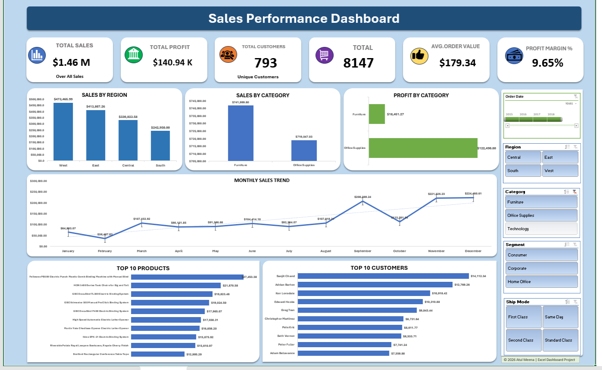

# Sales Performance Dashboard

## Project Overview

The Sales Performance Dashboard is an interactive Excel dashboard developed to analyze business sales performance using real-world sales data. It enables users to monitor key business metrics, compare regional and category-wise performance, analyze monthly sales trends, and identify top-performing products and customers through interactive filters.

This project demonstrates practical Excel dashboard development skills used in business reporting and decision-making.

---

## Business Objective

The objective of this dashboard is to provide business users with a single interactive report that helps them:

- Monitor overall sales performance
- Track profitability across product categories
- Compare sales performance by region
- Analyze monthly sales trends
- Identify top-performing products
- Identify valuable customers
- Filter data dynamically for faster business analysis

---

## Dashboard Preview



---

## Dataset

The dataset contains business sales transaction records, including:

- Orders
- Customers
- Products
- Categories
- Regions
- Sales
- Profit
- Quantity
- Order Date
- Ship Mode

---

## Key Performance Indicators (KPIs)

| KPI | Description |
|------|-------------|
| Total Sales | Total revenue generated |
| Total Profit | Total profit earned |
| Total Customers | Number of unique customers |
| Total Orders | Total orders processed |
| Average Order Value | Average revenue per order |
| Profit Margin % | Overall profit percentage |

---

## Dashboard Features

- Interactive KPI Cards
- Regional Sales Analysis
- Category-wise Sales Analysis
- Category-wise Profit Analysis
- Monthly Sales Trend
- Top 10 Products Analysis
- Top 10 Customers Analysis
- Dynamic Slicers for Interactive Filtering

---

## Tools & Techniques Used

- Microsoft Excel
- Power Query
- Pivot Tables
- Pivot Charts
- Slicers
- Excel Formulas
- Conditional Formatting

---

## Skills Demonstrated

- Data Cleaning
- Data Transformation
- Data Analysis
- Dashboard Development
- KPI Design
- Data Visualization
- Interactive Reporting
- Business Insights

---

## Key Business Insights

- Compare sales performance across different regions.
- Identify the most profitable product categories.
- Analyze monthly sales growth and seasonal trends.
- Discover the highest revenue-generating products.
- Identify high-value customers.
- Support business decisions using interactive filtering.

---

## Project Files

```
Sales Performance Dashboard.xlsx
Dashboard.png
README.md
```

---

## Author

**Atul Meena**

Aspiring Data Analyst

